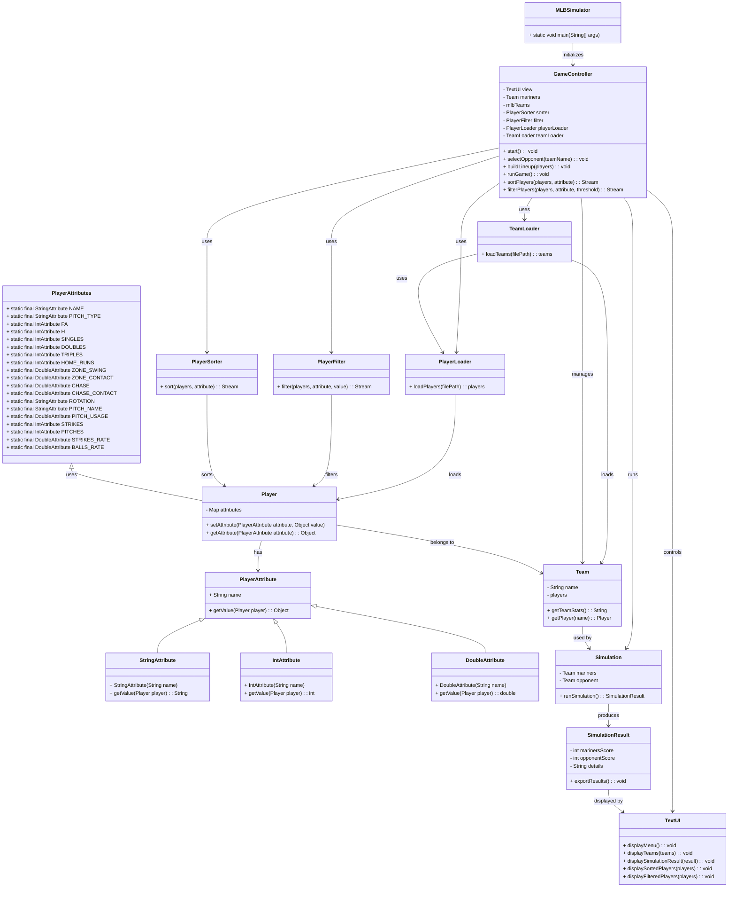

# Initial Design

```mermaid
---
Title Initial Design
---
classDiagram
direction TB

    class MLBSimulator {
        + static void main(String[] args)
    }

    %% Model
    class Player {
        - Map<PlayerAttribute, Object> attributes
        + setAttribute(PlayerAttribute attribute, Object value)
        + getAttribute(PlayerAttribute attribute): Object
    }

    class PlayerAttribute {
        + String name
        + getValue(Player player): Object
    }

    class StringAttribute {
        + StringAttribute(String name)
        + getValue(Player player): String
    }

    class IntAttribute {
        + IntAttribute(String name)
        + getValue(Player player): int
    }

    class DoubleAttribute {
        + DoubleAttribute(String name)
        + getValue(Player player): double
    }

    class PlayerAttributes {
        + static final StringAttribute NAME
        + static final StringAttribute PITCH_TYPE
        + static final IntAttribute PA
        + static final IntAttribute H
        + static final IntAttribute SINGLES
        + static final IntAttribute DOUBLES
        + static final IntAttribute TRIPLES
        + static final IntAttribute HOME_RUNS
        + static final DoubleAttribute ZONE_SWING
        + static final DoubleAttribute ZONE_CONTACT
        + static final DoubleAttribute CHASE
        + static final DoubleAttribute CHASE_CONTACT
        + static final StringAttribute ROTATION
        + static final StringAttribute PITCH_NAME
        + static final DoubleAttribute PITCH_USAGE
        + static final IntAttribute STRIKES
        + static final IntAttribute PITCHES
        + static final DoubleAttribute STRIKES_RATE
        + static final DoubleAttribute BALLS_RATE
    }
    
    class Team {
        - String name
        - players
        + getTeamStats(): String
        + getPlayer(name): Player
    }

    class Simulation {
        - Team mariners
        - Team opponent
        + runSimulation(): SimulationResult
    }

    class SimulationResult {
        - int marinersScore
        - int opponentScore
        - String details
        + exportResults(): void
    }

    %% Model: Data Loading
    class PlayerLoader {
        + loadPlayers(filePath): players
    }

    class TeamLoader {
        + loadTeams(filePath): teams
    }

    %% Model: Sorting and Filtering
    class PlayerSorter {
        + sort(players, attribute): Stream
    }

    class PlayerFilter {
        + filter(players, attribute, value): Stream
    }
 
    %% View
    class TextUI {
        + displayMenu(): void
        + displayTeams(teams): void
        + displaySimulationResult(result): void
        + displaySortedPlayers(players): void
        + displayFilteredPlayers(players): void
    }

    %% Controller
    class GameController {
        - TextUI view
        - Team mariners
        - mlbTeams
        - PlayerSorter sorter
        - PlayerFilter filter
        - PlayerLoader playerLoader
        - TeamLoader teamLoader
        + start(): void
        + selectOpponent(teamName): void
        + buildLineup(players): void
        + runGame(): void
        + sortPlayers(players, attribute): Stream
        + filterPlayers(players, attribute, threshold): Stream
    }

    %% Relationships
    MLBSimulator --> GameController : Initializes 
    PlayerAttribute <|-- StringAttribute
    PlayerAttribute <|-- IntAttribute
    PlayerAttribute <|-- DoubleAttribute
    PlayerAttributes <|-- Player : uses
    Player --> Team : belongs to
    Player --> PlayerAttribute : has
    Team --> Simulation : used by
    Simulation --> SimulationResult : produces
    SimulationResult --> TextUI : displayed by
    GameController --> TextUI : controls
    GameController --> Team : manages
    GameController --> Simulation : runs
    GameController --> PlayerSorter : uses
    GameController --> PlayerFilter : uses
    PlayerSorter --> Player : sorts
    PlayerFilter --> Player : filters
    PlayerLoader --> Player : loads
    TeamLoader --> Team : loads
    TeamLoader --> PlayerLoader : uses
    GameController --> PlayerLoader : uses
    GameController --> TeamLoader : uses
```
