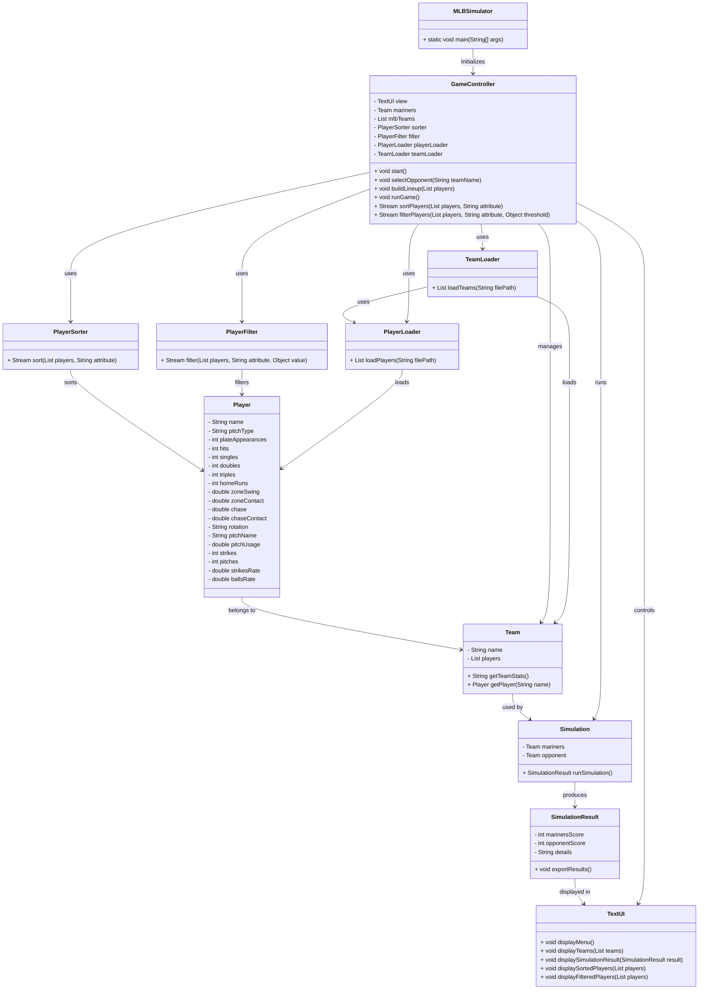

# Initial Design

```mermaid
---
Title Initial Design
---
classDiagram
direction TB

    class MLBSimulator {
        + static void main(String[] args)
    }

    %% Model
    class Player {
        - String name
        - String pitchType
        - int plateAppearances
        - int hits
        - int singles
        - int doubles
        - int triples
        - int homeRuns
        - double zoneSwing
        - double zoneContact
        - double chase
        - double chaseContact
        - String rotation
        - String pitchName
        - double pitchUsage
        - int strikes
        - int pitches
        - double strikesRate
        - double ballsRate
    }

    class Team {
        - String name
        - List<Player> players
        + String getTeamStats()
        + Player getPlayer(String name)
    }

    class Simulation {
        - Team mariners
        - Team opponent
        + SimulationResult runSimulation()
    }

    class SimulationResult {
        - int marinersScore
        - int opponentScore
        - String details
        + void exportResults()
    }

    %% Model: Data Loading
    class PlayerLoader {
        + List<Player> loadPlayers(String filePath)
    }

    class TeamLoader {
        + List<Team> loadTeams(String filePath)
    }

    %% Model: Sorting and Filtering
    class PlayerSorter {
        + Stream<Player> sort(List<Player> players, String attribute)
    }

    class PlayerFilter {
        + Stream<Player> filter(List<Player> players, String attribute, Object value)
    }

    %% View
    class TextUI {
        + void displayMenu()
        + void displayTeams(List<Team> teams)
        + void displaySimulationResult(SimulationResult result)
        + void displaySortedPlayers(List<Player> players)
        + void displayFilteredPlayers(List<Player> players)
    }

    %% Controller
    class GameController {
        - TextUI view
        - Team mariners
        - List<Team> mlbTeams
        - PlayerSorter sorter
        - PlayerFilter filter
        - PlayerLoader playerLoader
        - TeamLoader teamLoader
        + void start()
        + void selectOpponent(String teamName)
        + void buildLineup(List<Player> players)
        + void runGame()
        + Stream<Player> sortPlayers(List<Player> players, String attribute)
        + Stream<Player> filterPlayers(List<Player> players, String attribute, Object threshold)
    }

    %% Relationships
    MLBSimulator --> GameController : Initializes
    Player --> Team : belongs to
    Team --> Simulation : used by
    Simulation --> SimulationResult : produces
    SimulationResult --> TextUI : displayed in
    GameController --> TextUI : controls
    GameController --> Team : manages
    GameController --> Simulation : runs
    GameController --> PlayerSorter : uses
    GameController --> PlayerFilter : uses
    PlayerSorter --> Player : sorts
    PlayerFilter --> Player : filters
    PlayerLoader --> Player : loads
    TeamLoader --> Team : loads
    TeamLoader --> PlayerLoader : uses
    GameController --> PlayerLoader : uses
    GameController --> TeamLoader : uses
```
